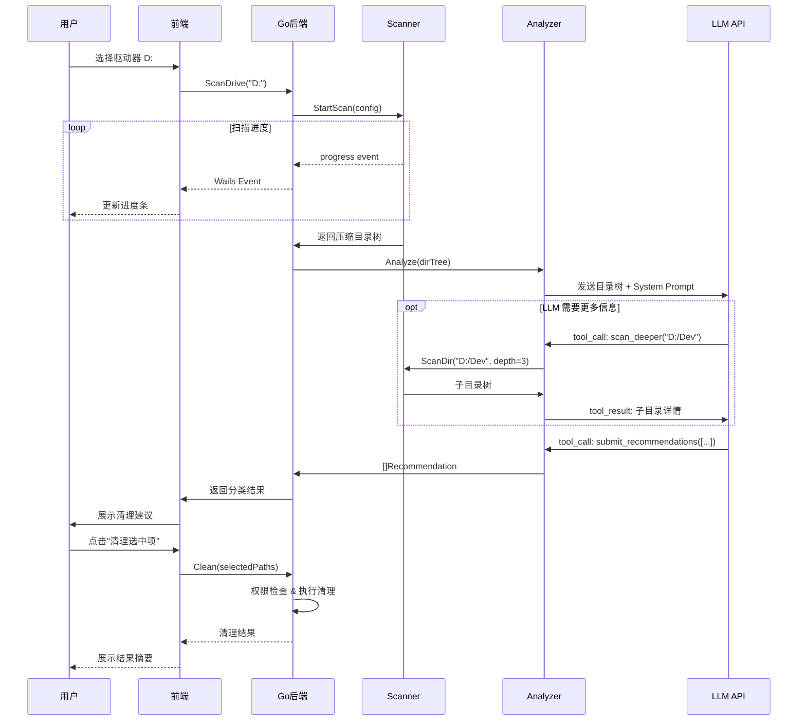

# DiskSage - 智能磁盘清理助手 详细计划书

## 一、项目概述

**项目名称**: DiskSage  
**技术栈**: Go 1.21+ / Wails v2 / React + TypeScript (前端)  
**目标平台**: Windows 10/11  
**核心理念**: 利用 LLM 的知识库智能识别可清理内容，而非传统的硬编码规则

---

## 二、核心架构

```
┌─────────────────────────────────────────────────┐
│                   Wails Frontend                │
│          React + TypeScript + CSS               │
│  ┌───────────┐ ┌──────────┐ ┌───────────────┐  │
│  │ DiskView  │ │ Results  │ │ Settings      │  │
│  │ (选择磁盘)│ │ (清理建议)│ │ (API Key等)   │  │
│  └───────────┘ └──────────┘ └───────────────┘  │
└──────────────────┬──────────────────────────────┘
                   │ Wails Bindings
┌──────────────────┴──────────────────────────────┐
│                   Go Backend                    │
│  ┌───────────┐ ┌──────────┐ ┌───────────────┐  │
│  │ Scanner   │ │ Analyzer │ │ Cleaner       │  │
│  │ 磁盘扫描  │ │ LLM分析  │ │ 执行清理      │  │
│  └───────────┘ └──────────┘ └───────────────┘  │
│  ┌───────────┐ ┌──────────┐                     │
│  │ Privilege  │ │ Config   │                     │
│  │ 权限管理   │ │ 配置管理  │                     │
│  └───────────┘ └──────────┘                     │
└─────────────────────────────────────────────────┘
```

---

## 三、项目结构

```
DiskSage/
├── main.go                     # Wails 入口
├── app.go                      # Wails App 绑定层（薄层，调用 service）
├── wails.json
├── go.mod / go.sum
│
├── internal/
│   ├── scanner/
│   │   ├── scanner.go          # 核心扫描引擎
│   │   ├── dirtree.go          # 目录树数据结构
│   │   └── filter.go           # 过滤与噪声消除
│   │
│   ├── analyzer/
│   │   ├── analyzer.go         # LLM 分析协调器
│   │   ├── prompt.go           # Prompt 模板与构建
│   │   ├── parser.go           # LLM 响应解析（JSON Schema）
│   │   └── toolcall.go         # LLM Function Calling 工具定义
│   │
│   ├── cleaner/
│   │   ├── cleaner.go          # 清理执行引擎
│   │   ├── strategy.go         # 清理策略（删除/命令行/移动到回收站）
│   │   └── history.go          # 清理历史记录
│   │
│   ├── privilege/
│   │   ├── elevation.go        # UAC 权限提升
│   │   └── check.go            # 权限检测
│   │
│   ├── config/
│   │   └── config.go           # 配置管理（API Key、模型等）
│   │
│   └── models/
│       └── types.go            # 共享数据类型定义
│
├── frontend/
│   ├── src/
│   │   ├── App.tsx
│   │   ├── main.tsx
│   │   ├── index.css           # 全局样式 / 设计系统
│   │   │
│   │   ├── components/
│   │   │   ├── DiskSelector.tsx    # 磁盘选择
│   │   │   ├── ScanProgress.tsx    # 扫描进度
│   │   │   ├── ResultList.tsx      # 清理建议列表
│   │   │   ├── ResultCard.tsx      # 单条建议卡片
│   │   │   ├── CleanupDialog.tsx   # 确认清理对话框
│   │   │   └── SettingsPanel.tsx   # 设置面板
│   │   │
│   │   ├── hooks/
│   │   │   └── useCleanup.ts      # 清理流程 Hook
│   │   │
│   │   └── lib/
│   │       ├── format.ts          # 格式化工具（文件大小等）
│   │       └── wailsbridge.ts     # Wails 绑定类型封装
│   │
│   ├── package.json
│   └── vite.config.ts
│
└── build/
    └── windows/
        ├── icon.ico
        └── info.json
```

---

## 四、核心模块设计

### 4.1 扫描引擎 (`internal/scanner`)

这是整个系统的**Token 节省关键**。目标是将磁盘信息**高度压缩**后再给 LLM 分析。

#### 扫描策略：**自适应深度扫描**

```go
type ScanConfig struct {
    MaxDepth       int      // 默认最大深度 4
    MinDirSize     int64    // 忽略小于此值的目录，默认 50MB
    SkipDirs       []string // 跳过的目录（如 Windows、$Recycle.Bin）
    TopN           int      // 每层只保留 Top N 大的目录，默认 20
}
```

**扫描流程**：

1. **第一遍：快速扫描** - 以深度 1 扫描所选驱动器根目录，获取所有一级目录的大小
2. **智能递归** - 仅对大目录（>MinDirSize）继续递归，小目录直接作为叶子节点
3. **生成压缩目录树** - 输出为紧凑文本格式给 LLM

#### 输出格式（给 LLM 的压缩格式）

```
D:\
├── [28.5G] Games/
│   ├── [15.2G] Steam/steamapps/common/
│   └── [13.3G] Epic/
├── [12.1G] Development/
│   ├── [4.2G] node_modules/ (npm)
│   ├── [3.8G] .gradle/caches/
│   ├── [2.1G] go/pkg/mod/
│   └── [2.0G] .cargo/registry/
├── [8.7G] Downloads/
│   ├── [3.2G] *.iso (3 files)
│   └── [2.1G] *.zip (12 files)
├── [5.3G] temp/
└── ... (42 more dirs, total 3.2G)
```

**关键优化**：
- 同类型文件聚合（如 `*.iso (3 files)`），不列出每个文件
- 自动识别并标注已知项目类型（`npm`, `gradle`, `cargo` 等），通过检测特征文件（`package.json`, `build.gradle` 等）
- 小目录汇总为 `... (N more dirs, total XG)`
- 路径中间层如果只有一个大子目录，自动合并（如 `Steam/steamapps/common/`）

### 4.2 LLM 分析器 (`internal/analyzer`)

#### 架构：Function Calling + Structured Output

不使用简单的 prompt → text 模式，而是使用 **Function Calling** 让 LLM 有更强的控制能力：

**可用工具（提供给 LLM）**：

| 工具名 | 描述 | 用途 |
|--------|------|------|
| `scan_deeper` | 对指定目录以更深层级重新扫描 | LLM 认为某目录需要更细致分析时调用 |
| `check_dir_content` | 查看指定目录的文件类型分布 | 确认目录内容性质 |
| `submit_recommendations` | 提交最终清理建议 | 输出结构化结果 |

**分析流程**：

```
1. 系统发送压缩目录树 → LLM
2. LLM 可能调用 scan_deeper / check_dir_content 获取更多信息
3. LLM 调用 submit_recommendations 返回结构化建议
```

**这样做的好处**：
- LLM 自己决定是否需要更详细的信息，而非我们盲目扫描所有目录
- 大幅节省 Token（只在需要时才提供详细信息）
- 结构化输出，无需复杂解析

#### 清理建议的数据结构

```go
type Recommendation struct {
    Path        string           `json:"path"`
    Size        int64            `json:"size"`
    Category    CleanCategory    `json:"category"`
    Reason      string           `json:"reason"`       // 简短说明
    CleanMethod CleanMethod      `json:"clean_method"` // 清理方式
    Command     string           `json:"command"`      // manual 时的建议命令
    Risk        string           `json:"risk"`         // 风险说明
}

type CleanCategory string
const (
    CategorySafe    CleanCategory = "safe"    // 安全清理：临时文件、缓存等
    CategoryConfirm CleanCategory = "confirm" // 确认清理：旧下载、过期备份等
    CategoryManual  CleanCategory = "manual"  // 手动清理：需要特定命令
    CategoryReview  CleanCategory = "review"  // 建议检查：不确定是否可清理
)

type CleanMethod string
const (
    MethodDelete    CleanMethod = "delete"      // 直接删除（移至回收站）
    MethodCommand   CleanMethod = "command"     // 执行命令行
    MethodRecycle   CleanMethod = "recycle"     // 移至回收站
    MethodRedirect  CleanMethod = "redirect"    // 打开文件管理器让用户处理
)
```

> **新增 `review` 类别**：用于 LLM 不确定但觉得可能有清理价值的目录，让用户自己判断。

#### Prompt 设计

**System Prompt**（精简版）：

```
你是磁盘清理助手。分析目录树，识别可清理的内容。

分类规则：
- safe: 临时文件、构建产物、包管理器缓存、日志文件、浏览器缓存
- confirm: 旧的下载文件、过期备份、大型但可能不再需要的文件  
- manual: 需要特定工具命令清理的（npm cache clean、docker system prune等）
- review: 不确定用途的大目录，建议用户检查

注意事项：
- 不要建议清理系统关键目录（Windows, Program Files, 驱动等）
- 不要建议清理正在使用的应用数据
- node_modules 只清理非活跃项目的（可通过最近修改时间判断）
- 优先关注大的、明确可清理的目标
```

### 4.3 清理执行器 (`internal/cleaner`)

#### 清理策略

| 方法 | 实现 | 安全措施 |
|------|------|----------|
| `delete` | `os.RemoveAll` → 回收站 API | 默认移至回收站，可选永久删除 |
| `command` | `exec.Command` 执行清理命令 | 展示命令内容，用户确认后执行 |
| `redirect` | `explorer.exe /select,path` | 打开文件管理器定位到目录 |

#### 安全机制

- **Safe** 类别：批量选中，一键清理（仍会先展示列表）
- **Confirm** 类别：逐条确认，展示详细说明和风险
- **Manual** 类别：展示推荐命令，用户点击复制或直接执行
- **Review** 类别：仅展示信息，提供"打开文件夹"按钮

### 4.4 权限管理 (`internal/privilege`)

```go
// 检测当前是否有管理员权限
func IsElevated() bool

// 检测指定路径是否需要管理员权限
func NeedsElevation(path string) bool

// 以管理员权限重启程序
func RequestElevation() error
```

**策略**：
- 程序启动时不要求管理员权限
- 扫描时标记需要提权的目录
- 清理时如果目标需要提权，弹出 UAC 提示
- C 盘系统目录（`Windows\Temp` 等）标记为需要提权

---

## 五、前端 UI 设计

### 5.1 页面流程

```
[启动页: 磁盘选择] → [扫描中: 进度动画] → [结果页: 分类建议列表] → [清理中: 进度]
                                                                 ↕
                                                        [设置: API Key 配置]
```

### 5.2 界面元素

#### 主界面 - 结果页（核心页面）

```
┌──────────────────────────────────────────────────┐
│  DiskSage                          ⚙️ Settings   │
├──────────────────────────────────────────────────┤
│                                                  │
│  D: 盘扫描完成  可节省 45.2 GB                    │
│                                                  │
│  ┌─ 🟢 安全清理 (Safe) ─── 预计释放 18.3 GB ───┐ │
│  │ ☑ D:\temp\                    5.3 GB  [🗑️]  │ │
│  │ ☑ D:\Dev\.gradle\caches\     3.8 GB  [🗑️]  │ │
│  │ ☑ D:\Users\...\AppData\...   2.1 GB  [🗑️]  │ │
│  │ ...                                          │ │
│  │              [🧹 清理选中项 (18.3 GB)]        │ │
│  └──────────────────────────────────────────────┘ │
│                                                  │
│  ┌─ 🟡 需确认 (Confirm) ─── 预计释放 12.8 GB ──┐ │
│  │ ☐ D:\Downloads\*.iso (3)     3.2 GB  [📂]   │ │
│  │   → 3个ISO镜像文件，超过90天未访问             │ │
│  │ ☐ D:\Backup\2024-old\        8.1 GB  [📂]   │ │
│  │   → 旧备份目录，建议确认是否仍需要             │ │
│  └──────────────────────────────────────────────┘ │
│                                                  │
│  ┌─ 🔵 手动清理 (Manual) ─── 预计释放 8.4 GB ──┐ │
│  │ D:\Dev\node_modules\ (5个项目) 4.2 GB        │ │
│  │   → npm cache clean --force        [▶️ 执行]  │ │
│  │ D:\Docker\                    4.2 GB          │ │
│  │   → docker system prune -a         [📋 复制]  │ │
└──────────────────────────────────────────────┘ │
│                                                  │
│  ┌─ ⚪ 建议检查 (Review) ─── 6.7 GB ───────────┐ │
│  │ D:\OldProject\                3.2 GB  [📂]  │ │
│  │   → 最近6个月未修改的项目目录                   │ │
│  └──────────────────────────────────────────────┘ │
│                                                  │
└──────────────────────────────────────────────────┘
```

### 5.3 设计风格

- **暗色主题**为主，搭配深灰/深蓝底色
- 卡片式布局，分类用颜色左边框区分
- 扫描时的粒子/波纹动画效果
- 文件大小用渐变色柱状图可视化
- 响应式过渡动画（展开/收起分类卡片）

---

## 六、LLM API 集成细节

### 6.1 支持的模型

```go
type LLMConfig struct {
    Provider    string // "openai", "anthropic", "custom"
    APIKey      string
    Model       string // 默认 "gpt-4o-mini" 或 "claude-3-haiku"
    BaseURL     string // 自定义 API 端点（支持 OpenAI 兼容接口）
    MaxTokens   int
}
```

优先支持 **OpenAI 兼容接口**（覆盖面最广），同时支持自定义 BaseURL（兼容各种代理和其他提供商）。

### 6.2 Token 节省策略

| 策略 | 预计节省 | 方式 |
|------|----------|------|
| 压缩目录树格式 | ~60% | 合并路径、聚合文件、省略小目录 |
| 按需深扫 | ~40% | LLM 自己决定是否需要更详细信息 |
| 精简 System Prompt | ~20% | 简洁的规则描述 |
| 智能剪枝 | ~30% | 已知系统目录直接跳过，不发给 LLM |

**预计单次完整分析**：输入 ~1500-3000 tokens，输出 ~500-1000 tokens  
（取决于磁盘复杂度和 LLM 调用 scan_deeper 的次数）

### 6.3 预过滤（减少 LLM 工作量）

在发送给 LLM 之前，Scanner 自动标注已知可识别的项目：

```go
// 通过特征文件识别目录类型
var knownMarkers = map[string]string{
    "package.json":    "nodejs",
    "go.mod":          "golang",
    "Cargo.toml":      "rust",
    "build.gradle":    "gradle",
    "pom.xml":         "maven",
    ".git":            "git-repo",
    "docker-compose.yml": "docker",
}
```

这些标注会附加在目录树中，帮助 LLM 更快做出判断。

---

## 七、数据流详细设计



---

## 八、安全与边界考虑

### 绝对不清理的目录（硬编码黑名单）

```go
var systemBlacklist = []string{
    `C:\Windows`,
    `C:\Program Files`,
    `C:\Program Files (x86)`,
    `C:\Users\*\NTUSER.DAT`,
    `$Recycle.Bin`,
    `System Volume Information`,
}
```


